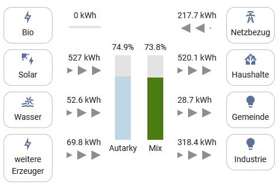

# EON Energiemonitor [[Home Assistant](https://www.home-assistant.io/) Component]

[](https://github.com/custom-components/hacs)

This custom component integrates the EON Energiemonitor into Home Assistant. The sensor values are fetched from the API that is the backend of the EON Energiemonitor and follows the visualization in <https://energiemonitor.bayernwerk.de/demo>.

## Installation

Copy content of custom_components to your local custom_components folder and add the following lines to your configuration.

## Configuration

```yaml
eon-energiemonitor:
  region_code: XXXXXX
  scan_interval: 5
```

Configuration variables:

* **region_code**: The location ID you want to collect values from. You can find it by analyzing the network traffic of the webpage as shown in the following.
* **scan_interval** (optional): How often new updates should be fetched. In minutes, default 5 minutes same as the official web app.


Works best with the [power-distribution-card](https://github.com/JonahKr/power-distribution-card) by [JonahKr](https://github.com/JonahKr).



<details>
  <summary>Power-distribution-card config</summary>
  
```
type: 'custom:power-distribution-card'
title: Energiemonitor
entities:
  - decimals: 2
    display_abs: true
    name: Bio
    unit_of_display: kWh
    unit_of_measurement: kWh
    icon: 'mdi:lightning-bolt-outline'
    producer: true
    entity: sensor.eon_energiemonitor_bio
    preset: producer
  - decimals: 2
    display_abs: true
    name: Netzbezug
    unit_of_display: kWh
    unit_of_measurement: kWh
    icon: 'mdi:transmission-tower'
    entity: sensor.eon_energiemonitor_secondaryinfeed
    preset: grid
  - decimals: 2
    display_abs: true
    name: Solar
    unit_of_display: kWh
    unit_of_measurement: kWh
    icon: 'mdi:solar-power'
    producer: true
    entity: sensor.eon_energiemonitor_solar
    preset: solar
  - decimals: 2
    display_abs: true
    name: Haushalte
    unit_of_display: kWh
    unit_of_measurement: kWh
    consumer: true
    invert_value: true
    icon: 'mdi:home-assistant'
    entity: sensor.eon_energiemonitor_domestic
    preset: home
  - decimals: 2
    display_abs: true
    name: Wasser
    unit_of_display: kWh
    unit_of_measurement: kWh
    icon: 'mdi:hydro-power'
    producer: true
    entity: sensor.eon_energiemonitor_water
    preset: hydro
  - decimals: 2
    display_abs: true
    name: Gemeinde
    unit_of_display: kWh
    unit_of_measurement: kWh
    consumer: true
    invert_value: true
    icon: 'mdi:lightbulb'
    entity: sensor.eon_energiemonitor_public
    preset: consumer
  - decimals: 2
    display_abs: true
    name: weitere Erzeuger
    unit_of_display: kWh
    unit_of_measurement: kWh
    icon: 'mdi:lightning-bolt-outline'
    producer: true
    entity: sensor.eon_energiemonitor_others
    preset: producer
  - decimals: 2
    display_abs: true
    name: Industrie
    unit_of_display: kWh
    unit_of_measurement: kWh
    consumer: true
    invert_value: true
    icon: 'mdi:lightbulb'
    entity: sensor.eon_energiemonitor_industrial
    preset: consumer
center:
  type: bars
  content:
    - name: Autarky
      preset: custom
      bar_color: lightblue
      bar_bg_color: ''
      entity: sensor.eon_energiemonitor_autarky
    - name: Mix
      preset: custom
      bar_color: green
      bar_bg_color: ''
      entity: sensor.eon_energiemonitor_energymix
animation: slide
```
</details>
