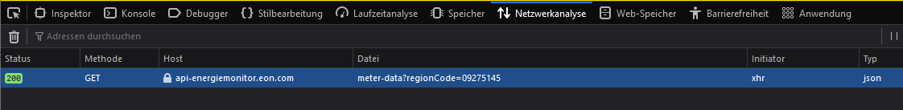

# EON Energiemonitor [[Home Assistant](https://www.home-assistant.io/) Component]

[](https://github.com/custom-components/hacs)

This custom component integrates the EON Energiemonitor into Home Assistant. The sensor values are fetched from the API that is the backend of the EON Energiemonitor and follows the visualization in <https://energiemonitor.bayernwerk.de/demo>.

## Installation

Copy content of custom_components to your local custom_components folder and add the following lines to your configuration.

## Configuration

```yaml
eon-energiemonitor:
  region_code: XXXXXX
  scan_interval: 5
```

Configuration variables:

* **region_code**: The location ID you want to collect values from. You can find it by analyzing the network traffic of the webpage as shown in the following.
* **scan_interval**: How often new updates should be fetched. In minutes, default 5 minutes same as the official web app.



Works best with the [power-distribution-card](https://github.com/JonahKr/power-distribution-card) by [JonahKr](https://github.com/JonahKr).
